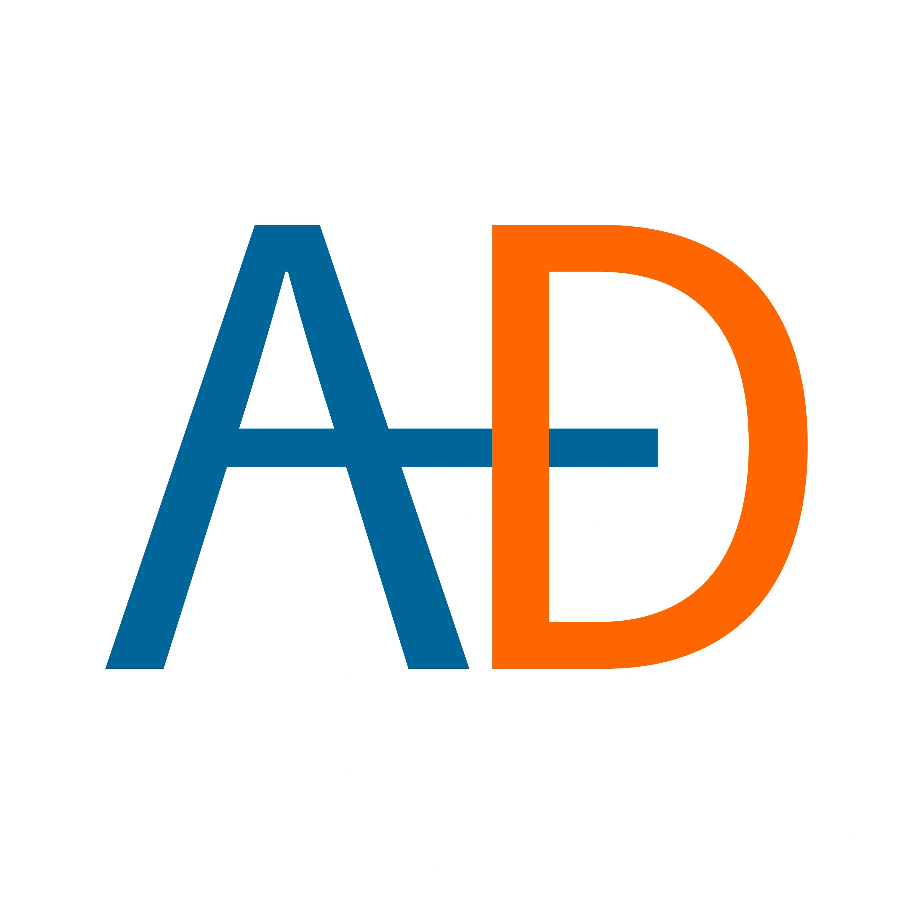

# 🚗💡 Looking for a Maintainer & Open Source Collaboration!

Hey there! 👋 This project is currently looking for someone passionate to **maintain and evolve** it, see https://github.com/ankandrew/aware-driving/issues/7.

---

# [Aware Driving](https://ankandrew.github.io/aware-driving)

### Intro

**Aware Driving** (AD) is a mobile app that will assist you while you are driving. Use it with your regular smartphone,
there’s no need to buy extra equipment. We use AI/Machine Learning to alert when you are **asleep**, **distracted** or
your **face can't be clearly seen**. **_Share_** this app to whoever may need it!

### Acknowledgement

* `assets/privacy_icon.svg`: https://www.svgrepo.com/svg/99424/lock
* `assets/smartphone_icon.svg`: https://www.svgrepo.com/svg/291682/smartphone-camera
    * _alt (not used)_: https://www.reshot.com/free-svg-icons/item/camera-app-L3KV7WJFZ4/
* `assets/free_icon.svg`: https://www.reshot.com/free-svg-icons/item/heart-money-X9TM6SRL2W/
* `assets/no_wifi_icon.svg`: https://www.reshot.com/free-svg-icons/item/no-signal-X742HAMFL6/
